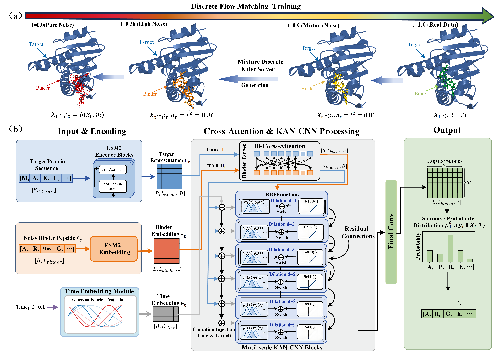

# KAN-Flow: Discrete Flow Matching with Kolmogorov–Arnold Networks for Target-Conditioned Therapeutic Peptide Design

[](https://www.python.org/)
[](https://pytorch.org/)
[](https://github.com/facebookresearch/esm)
[](LICENSE)
[](https://huggingface.co/datasets/Trybestxk/KAN-Flow)
[](https://huggingface.co/Trybestxk/KAN-Flow)

**A sequence-only generative framework for designing target-specific peptide binders from protein sequences, combining discrete flow matching with RBF-KAN-enhanced dilated convolutional networks.**

---



## Overview

KAN-Flow is a sequence-only, target-conditioned peptide generation framework that integrates two complementary modeling paradigms:

- **Discrete Flow Matching** — a continuous-time generative framework over discrete amino-acid token spaces. KAN-Flow learns a target-conditioned probability path from an all-mask prior toward the peptide data distribution, enabling progressive peptide generation directly in sequence space.
- **RBF-based Kolmogorov–Arnold Networks (RBF-KAN)** — adaptive nonlinear transformations embedded within dilated convolutional blocks. Learnable radial basis functions replace fixed-form nonlinear mappings and enable the model to capture position-sensitive and multi-scale residue interactions.

Target protein sequences are encoded using a frozen **ESM-2 (650M)** model. Bidirectional cross-attention is then used to model fine-grained dependencies between target residues and partially generated peptide positions.

Importantly, KAN-Flow requires **only the target protein sequence** during generation and does not require experimentally resolved or predicted three-dimensional target structures.

---

## Key Features

- **Target-conditioned discrete flow matching** with a quadratic probability-path scheduler for progressive amino-acid sequence generation
- **RBF-KAN dilated convolutional blocks** with learnable radial basis transformations for adaptive local and multi-scale residue modeling
- **Bidirectional cross-attention** between peptide representations and ESM-2 target residue embeddings
- **Sequence-only target conditioning** without requiring three-dimensional target structures or predefined binding-site information
- **Hard sequence-length constraints** enforced during generation to preserve valid peptide lengths
- **Combined training objective** using discrete flow-matching KL divergence and token-level cross-entropy
- **Parallel Euler sampling** for efficient discrete sequence generation
- **Early stopping and learning-rate scheduling** for robust model training

---

## Architecture

### Model Components

| Module | Description |
|---|---|
| `ConditionalCNNModel` | Main conditional denoising network that processes partially masked peptide tokens, flow time, and target representations |
| `FastKANConv1DLayer` | RBF-KAN-enhanced 1D convolutional layer with learnable radial basis transformations |
| `CrossAttentionBlock` | Bidirectional cross-attention module for fine-grained target–peptide interaction modeling |
| `TargetEmbeddingEncoder` | Projects frozen ESM-2 target residue representations into the model hidden space |
| `GaussianFourierProjection` | Encodes continuous flow time using Gaussian random Fourier features |
| `ConditionalConstrainedWrapper` | Applies sequence constraints during inference and controls valid peptide-token generation |

### RBF-KAN Backbone

The conditional denoising backbone contains six dilated `FastKANConv1DLayer` blocks with progressively enlarged receptive fields to capture both local and long-range residue dependencies:

```text
Block 1: kernel=3, dilation=1  (local)
Block 2: kernel=3, dilation=2
Block 3: kernel=3, dilation=4
Block 4: kernel=5, dilation=3
Block 5: kernel=3, dilation=8
Block 6: kernel=3, dilation=9  (long-range)
```

Each RBF-KAN block receives both a continuous **flow-time embedding** and a global **target protein representation** through additive feature modulation.

The RBF-KAN transformation combines an RBF-expanded adaptive branch with a conventional nonlinear base branch, allowing the network to learn flexible residue-dependent transformations while maintaining stable optimization.

### Target–Peptide Conditioning

KAN-Flow uses bidirectional cross-attention to model dependencies between the target protein and the evolving peptide sequence.

At each cross-attention stage:

1. peptide residues attend to target residues;
2. target representations are updated according to the current peptide state;
3. the resulting representations are propagated into subsequent conditional generation blocks.

This allows the target representation to adapt dynamically to the partially generated peptide sequence throughout the generation process.

---

## Discrete Flow Matching

KAN-Flow formulates peptide generation as a continuous-time Markov process that transports an all-mask prior toward the target-conditioned peptide distribution.

Generation follows a quadratic probability path:

```text
κ(t) = t²
```

which progressively increases the effective transition rate as the process approaches the peptide data distribution.

Rather than repeatedly applying stochastic denoising under a predefined corruption schedule, the model directly learns the transition dynamics associated with the desired probability path.

During inference, the continuous-time process is discretized using a first-order Euler solver, and all peptide positions are updated in parallel.

---

## Project Structure

```text
KAN-Flow/
├── model.py
├── train.py
├── inference_demo.py
├── loder.py
├── utils.py
├── process/
│   ├── alphabet_config.pkl
│   ├── esm_embedding_weights.pt
│   ├── train_dataset.csv
│   ├── val_dataset.csv
│   └── test_dataset.csv
└── ckpt/
    └── best_loss_model.ckpt
```

---

## Installation

```bash
git clone https://github.com/your-username/KAN-Flow.git
cd KAN-Flow

pip install torch torchvision
pip install fair-esm
pip install flow-matching
```

> **Note:** ESM-2 (650M) weights will be downloaded automatically on first use via:

```python
esm.pretrained.esm2_t33_650M_UR50D()
```

---

## 🤗 Hugging Face Resources

| Resource | Link | Description |
|---|---|---|
| 📦 **Dataset** | [Trybestxk/KAN-Flow](https://huggingface.co/datasets/Trybestxk/KAN-Flow) | Training, validation, and test peptide–target pairs |
| 🧠 **Model Weights** | [Trybestxk/KAN-Flow](https://huggingface.co/Trybestxk/KAN-Flow) | Pretrained KAN-Flow checkpoint |

### Download Model Weights

```python
from huggingface_hub import hf_hub_download

ckpt_path = hf_hub_download(
    repo_id="Trybestxk/KAN-Flow",
    filename="best_loss_model.ckpt",
    local_dir="./ckpt"
)
```

### Download Dataset

```python
from datasets import load_dataset

dataset = load_dataset("Trybestxk/KAN-Flow")
```

---

## Data Preparation

Each sample consists of a target protein sequence and its corresponding peptide binder sequence.

| Column | Description |
|---|---|
| `binder_sequence` | Peptide binder amino-acid sequence |
| `target_sequence` | Target protein amino-acid sequence |

---

## Training

```bash
python train.py
```

### Main Hyperparameters

```python
lr                = 1e-4
epochs            = 100
batch_size        = 64
embed_dim         = 512
hidden_dim        = 512
cross_attn_layers = 3
cross_attn_heads  = 8
ce_weight         = 1.0
NOISE_TYPE        = "mask"
```

### Training Objective

```text
L_total = L_DFM + λCE · L_CE
```

where `L_DFM` is the discrete flow-matching objective and `L_CE` is the auxiliary token-level cross-entropy objective.

---

## Inference

```bash
python inference_demo.py
```

```python
CHECKPOINT_PATH = "./ckpt/best_loss_model.ckpt"
TARGET_SEQUENCE = "MKTAYIAKQRQISFVK..."
PEPTIDE_LENGTH  = 15
N_SAMPLES       = 5
STEPS           = 150
```

Only the **target protein sequence** is required as biological conditioning information. No three-dimensional target structure is required.

---

## Sequence Constraints

```text
Position 0       → [CLS]
Position L − 1   → [EOS]
Positions 1…L−2  → amino-acid tokens only
Positions ≥ L    → [PAD]
```

---

## Reported Performance

KAN-Flow was evaluated on **15,164 peptide–protein complexes** and achieved:

- **FPD:** 0.451
- **MMD:** 0.005
- **Reference-space coverage:** 98.29%
- **Cα-RMSD:** 2.911 Å
- **Minimum predicted docking score:** −19.598 kcal/mol
- **86.3%** of generated peptides achieved a more favorable minimum docking score than their corresponding reference binders

---

## Ablation Analysis

Controlled ablation experiments evaluate three major components:

1. **Quadratic probability path**
2. **RBF-KAN convolutional backbone**
3. **Bidirectional target–peptide cross-attention**

Together, these components contribute complementary improvements in sequence-distribution fidelity, structural quality, and predicted docking performance.

---

## Applications

KAN-Flow has been evaluated in two representative therapeutic scenarios:

- **MHC-I epitope generation**
- **GLP-1 receptor agonist optimization**

These studies demonstrate the potential of KAN-Flow for therapeutic peptide design without requiring three-dimensional target structures.

---

## License

This project is licensed under the MIT License. See [LICENSE](LICENSE) for details.

---

## Acknowledgements

- [ESM-2](https://github.com/facebookresearch/esm) by Meta AI Research for protein sequence representation
- [flow-matching](https://github.com/facebookresearch/flow_matching) for discrete flow-matching utilities
- [FastKAN](https://github.com/ZiyaoLi/fast-kan) for efficient RBF-based KAN implementations

---

## Citation

If you find KAN-Flow useful in your research, please cite our work:

```bibtex
@article{kanflow2026,
  title   = {KAN-Flow: Discrete Flow Matching with Kolmogorov--Arnold Networks for Target-Conditioned Therapeutic Peptide Design},
  author  = {Wang, Guishen and Kong, Yuxiang and Fu, Yuyouqiang and others},
  year    = {2026}
}
```

> Citation information will be updated after publication.
